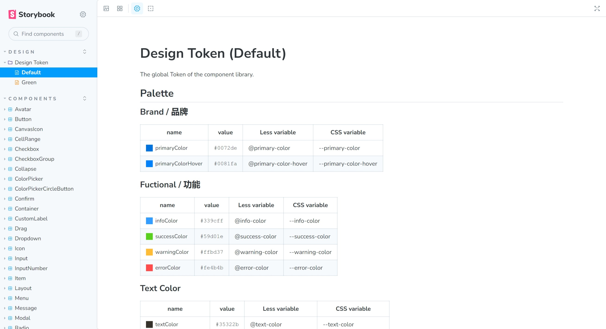

# @crabtable/design

## Package Overview

| Package Name | UMD Namespace | Version | License | Downloads | Contains CSS | Contains i18n locales |
| --- | --- | --- | --- | --- | :---: | :---: |
| `@crabtable/design` | `UniverDesign` | [![][npm-version-shield]][npm-version-link] | ![][npm-license-shield] | ![][npm-downloads-shield] | ⭕️ | ⭕️ |

## Introduction

To ensure better consistency in the UI of CrabTable plugins and to reduce the effort required for custom development, we provide some fundamental design guidelines and components.

The components are developed using React and less, and you can find out more information by visiting the [component library website](https://univer-design.vercel.app).



:::note
If you only need to extend the toolbar, context menu, and so on, you can directly use the extension interfaces provided by `@crabtable/ui` without implementing the UI yourself. For more information, please refer to [Extending UI](https://docs.crabtable.dev/guides/recipes/tutorials/custom-plugin).
:::

## Usage

### Installation

```shell
# Using npm
npm install @crabtable/design

# Using yarn
yarn add @crabtable/design
```

This package contains CSS and has the highest priority. Please import it before importing any other CrabTable style files.

<!-- Links -->
[npm-version-shield]: https://img.shields.io/npm/v/@crabtable/design?style=flat-square
[npm-version-link]: https://npmjs.com/package/@crabtable/design
[npm-license-shield]: https://img.shields.io/npm/l/@crabtable/design?style=flat-square
[npm-downloads-shield]: https://img.shields.io/npm/dm/@crabtable/design?style=flat-square
